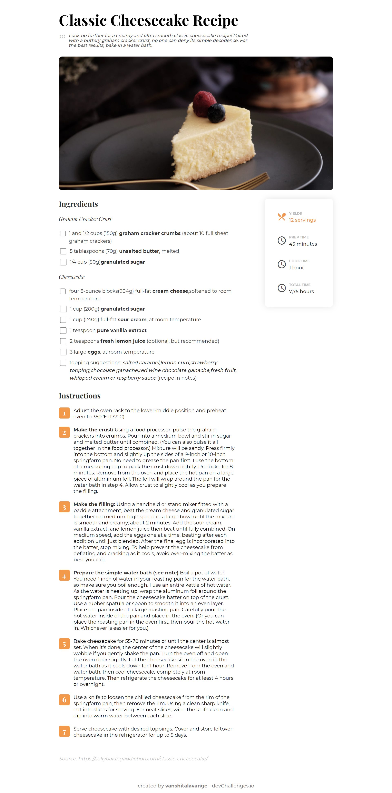
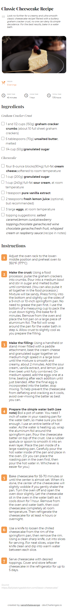

<!-- Please update value in the {}  -->

<h1 align="center">Recipe page</h1>

   Solution for a challenge from  <a href="http://devchallenges.io" target="_blank">Devchallenges.io</a>.

  <h3>
    <a href="https://know-cheesecake-recipe.netlify.app/">
      Demo
    </a>
     | 
    <a href="https://github.com/vanshitalavange/cheesecake-recipe-page">
      Solution
    </a>
     | 
    <a href="https://devchallenges.io/challenges/OEKdUZ6xs0h99C38XVht">
      Challenge
    </a>
  </h3>

<!-- TABLE OF CONTENTS -->

## Table of Contents

- [Overview](#overview)
  - [Built With](#built-with)
- [Features](#features)
- [Contact](#contact)
- [Acknowledgements](#acknowledgements)

<!-- OVERVIEW -->

## Overview

- Desktop view

  

- Mobile view

  

### Built With

<!-- This section should list any major frameworks that you built your project using. Here are a few examples.-->

- HTML
- CSS

## Features

<!-- List the features of your application or follow the template. Don't share the figma file here :) -->

This application/site was created as a submission to a [DevChallenges](https://devchallenges.io/challenges) challenge. The [challenge](https://devchallenges.io/challenges/TtUjDt19eIHxNQ4n5jps) was to build an application to complete the following user stories:

- [I can see a recipe with ingredients and instructions] User story: This is a completed user stories
- [ I can select a checkbox if I have the ingredients] User story: This is a completed user stories
- [  I can see the number of servings, baking times] User story: This is a completed 2nd user stories

## Acknowledgements

<!-- This section should list any articles or add-ons/plugins that helps you to complete the project. This is optional but it will help you in the future. For exmpale -->

- [CSS tricks](https://css-tricks.com/)

## Contact

- Website [my portfolio](https://vanshitalavange.netlify.app/)
- GitHub [vanshitalavange](https://github.com/vanshitalavange)
- Twitter [LavangeVanshita](https://twitter.com/LavangeVanshita)
